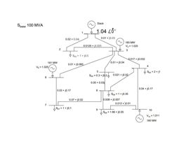

# A Comparison of intraday solar power forecasting methods

by
Sararut P.,
Chayanont P.,

This paper has been submitted for presentation in *2102499: Electrical Engineering Project*.

> This study is divided into two parts: to study the relevant variables of intraday solar irradiance foresting (clear sky model), and to compare forecasting models including `Linear regression`, `MARS`, `ANN` (baseline model), `SVR`, `Random forest` (proposed model).

