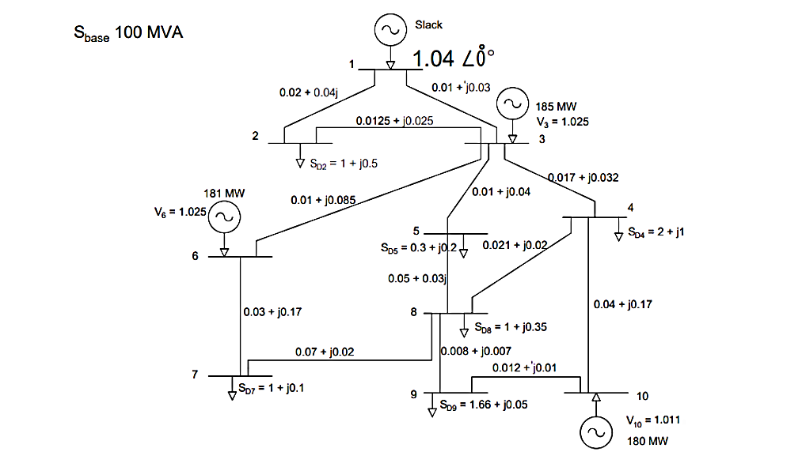

# POWER	FLOW ANALYSIS
### `NEWTON-RAPHSON	METHOD	FOR	10	BUS`

by `Sitthiwut T.`

This chapter deals with the steady-state analysis of an in terconnected power system during normal operation. The system is assumed to be operating under balanced condition and is represented by a single-phase network. The network contains hundreds of nodes and branches with impedances specified in per unit on a common *MVA base*.

Network equations can be formulated systematically in a variety of forms. However, the node-voltage method, which is the most suitable form for many power system analyses, is commonly used. The formulation of the network equa tions in the nodal admittance form results in complex linear simultaneous algebraic equations in terms of node currents. When node currents are specified, the set of linear equations can be solved for the node voltages. However, in a power system, powers are known rather than currents. Thus, the resulting equations in terms of power, known as the power flow equation, become nonlinear and must be solved by iterative techniques. Power flow studies, commonly referred to as load flow, are the backbone of power system analysis and design. They are necessary for plan ning, operation, economic scheduling and exchange of power between utilities. In addition, power flow analysis is required for many other analyses such as transient stability and contingency studies.
.
***
### `BUS ADMITTANCE MATRIX`
> In order to obtain the node-voltage equations, consider the simple power system shown in Figure below. where impedances are expressed in per unit on a common *MVA base* and   for simplicity resistances are neglected. Since the nodal solution is based upon `Kirchhoff's current law`, *impedances are converted to admittance*, i.e.

